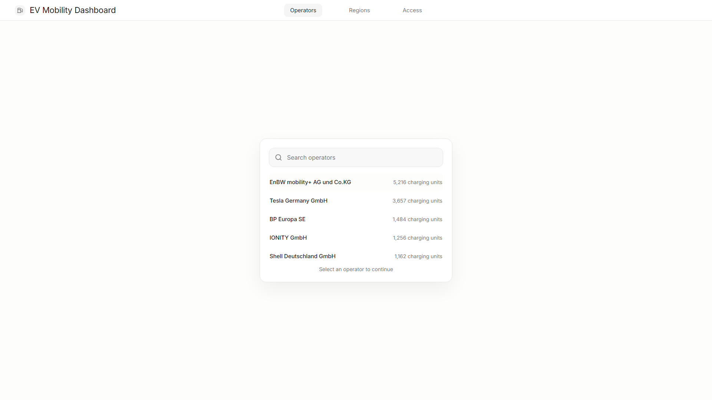

# 0003-operator-search Operator Search

Date: 2026-06-21

Screenshot:

## Summary

Centered operator search window backed by the generated operator index.

## Capture

- Route: `/`
- Viewport: `1920x1080`
- Server: temporary Vite server

## Verification

- Superseded by `0004-operator-search-polish` after row-rhythm polish and verification.

## Open Polish

- Row rhythm and input height were polished in `0004-operator-search-polish`.
