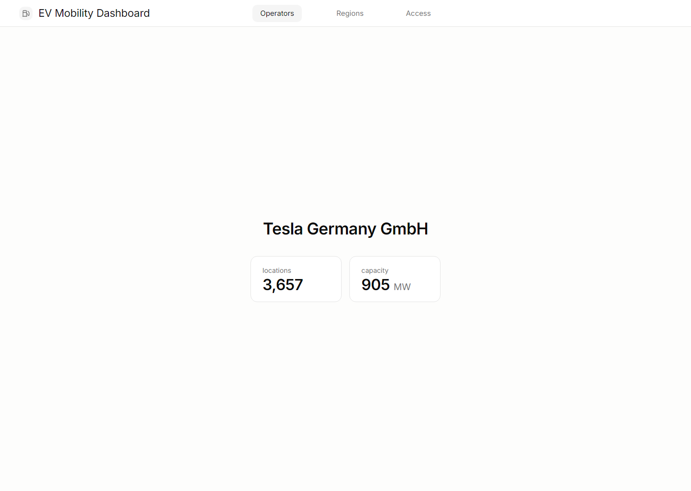

# 0005 Operator Detail Minimal

Date: 2026-06-21

Screenshot:

## Summary

Selecting an operator replaces the search window with a minimal operator identity view and two small KPI cards.

## Capture

- Flow: search `Tesla` -> select `Tesla Germany GmbH`
- Viewport: `1440x1024`
- Server: built `dist` served by a temporary static server

## Verification

- `npm run build` passed.
- `npm run lint` passed.
- Interaction smoke test passed: selected operator name is visible, `905` capacity value is visible, search input is hidden.
- Visual check compared against `design-references/operator-page-minimal/03-name-two-kpis-label-top.png`.

## Open Polish

- None for this stage.
