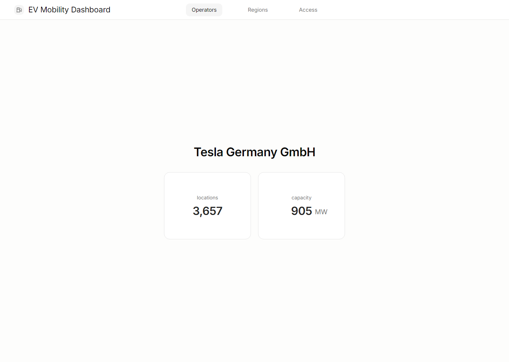

# 0008 Operator Detail Unit Alignment

Date: 2026-06-21

Screenshot:

## Summary

The capacity KPI now centers the numeric value independently, with the unit positioned as a lighter suffix.

## Capture

- Route: `/`
- State: `Tesla Germany GmbH` selected from operator search
- Viewport: `1440x1024`
- Server: temporary preview server

## Verification

- `npm run build`
- `npm run lint`
- Browser geometry check confirmed the value center matched the card center.

## Open Polish

- None recorded for this stage.
